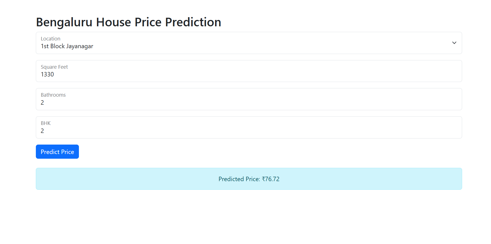

# Bengaluru-House-Price-Prediction

A web application to predict house prices in Bengaluru using a machine learning model.

[](https://www.python.org/)
[](LICENSE)

---

## Table of Contents

- [Overview](#overview)
- [Features](#features)
- [Installation & Setup](#installation--setup)
- [Usage](#usage)
- [Model Training](#model-training)
- [Screenshot](#screenshot)
---

## Overview

This project is a **Bengaluru House Price Prediction** application built with Flask. It allows users to input features such as location, square footage, number of bathrooms, and BHK configuration to estimate the house price in Bengaluru.

---

## Features

- **Interactive Web Interface:** Built with HTML, Bootstrap, and Flask.
- **Machine Learning Integration:** Uses a pre-trained model to predict house prices.
- **Data Preprocessing:** Leverages a cleaned dataset to improve prediction accuracy.
- **Error Handling:** Provides user-friendly error messages in case of invalid input.

---


## Installation & Setup

### 1. Clone the Repository

```
git clone https://github.com/MahendraLadva123/Bengaluru-House-Price-Prediction.git
cd Bengaluru-House-Price-Prediction
```
2. Install Dependencies:
```bash
pip install -r requirements.txt
```
```bash
pip install flask pandas scikit-learn numpy
```
3. Run Flask Application:
```bash
python app.py
```
4 Open Web App in Browser:
```bash
http://127.0.0.1:5000/
```


---

## Usage

1️⃣ **Select Location** → Choose the area from the dropdown menu.  
2️⃣ **Enter Square Footage** → Provide the total area in square feet.  
3️⃣ **Enter Bathrooms & BHK** → Input the number of bathrooms and BHKs.  
4️⃣ **Click "Predict Price"** → Get the estimated house price instantly.

---

## Model Training

The house price prediction model is trained using **Linear Regression**.  
The steps for training are available in `Bengaluru price prediction.ipynb`:

- **Data Cleaning**: Removing missing values, encoding categorical data, handling outliers.
- **Feature Engineering**: Extracting price per square foot, normalizing data.
- **Training Process**:
  - **Algorithm Used**: Linear Regression
  - **Libraries**: Scikit-Learn, Pandas, NumPy
  - **Model Performance**: 
    - **R² Score**: XX.X%
    - **Mean Absolute Error (MAE)**: X.XX
- **Model Deployment**: The trained model is serialized using `pickle` and stored as `model1.pkl`.


---
## Screenshot

---
